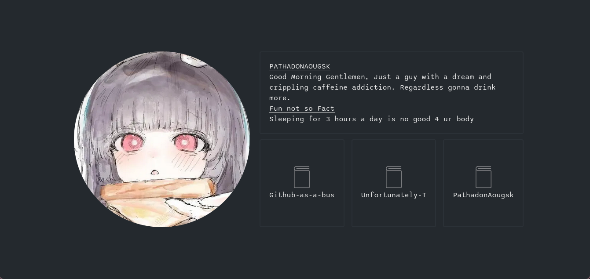

## Introduction

So here's the thing.

You've got a GitHub. It's got your repos, your green squares, your one impulsive
3am commit named "fix" (followed by "fix again"). But does it have *vibes*? Does it
hand itself to a stranger like a slightly-too-confident handshake?

Now it does.

**This turns your GitHub into a business card.** 

Is it useful? Debatable. Would a resume do the job better? Almost certainly.
Did that stop me? Absolutely not.

🔗 **See it live:** https://github-as-a-bussiness-card.vercel.app/

Fork it, break it, make it yours. Peace out.
